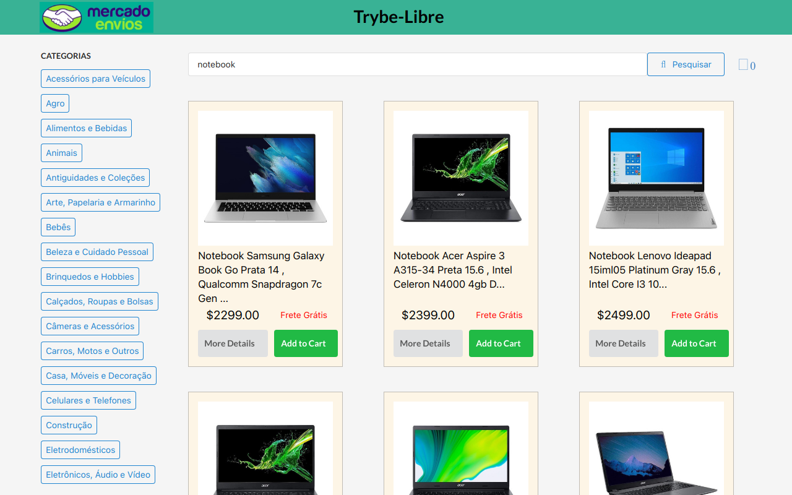

### TrybeLibre

Desafio do curso de FullStack Developer da TRYBE https://www.betrybe.com/

[Link para o Site](https://trybe-libre.vercel.app/)

## Tech em uso

[React] Aplication  
Gerenciamento de estado com [Class Components]  
Uso de API externas com0...
  - A [API do Mercado Livre](https://developers.mercadolivre.com.br/pt_br/api-docs-pt-br)

Uso da Biblioteca de CSS [Semantic UI](https://semantic-ui.com/)

  *Testes
    - [Linter] para controle da qualidade do codigo.
    - [Jest] com execução de testes por requisito

# Habilidades desenvolvidas.

-Componentizar o site em diversos arquivos menores  

-Fazer uso de props e CallBacks para conversar com os componentes filhos/pais  

-Fazer uso do ReactRouter para gerenciar a aplicação baseada em SPA  

-Editar a Promise provinda do mercado livre para se adaptar ao layoult da aplicação  

# O que foi desenvolvido.

Um site de compras onde por default se carrega uma paǵina com Computadores na tela inicial, mas que é possível mudar o valor do searchBar para poder selecionar melhor o que o usuário quer, além de também poder escolher uma categoria e assim filtrar melhor o resultado. Além disso é possível adicionar os items no carrinho e também ver os detalhes de cada produto. Uma vez na página de detalhes do produto é possível também adiciona-lo ao carrinho de compras. Na parte superior direita do site irá aparecer quantos items se possui no carrinho e caso ela seja clicada, o usuário será redirecionado à essa página, onde se pode excluir itens indesejáveis ou então alterar a sua quantidade. Uma vez decidido quais produtos se deseja realizar a compra, o usuário será redirecionado para um forms onde poderá preencher suas informações pessoais e informaões do cartão.

  - Entrar no site e ver um Searchbar em conjunto de uma lista de categorias e uma lista de produtos.
  - É possível adicionar os items ao carrinho, mostrando a quantidade de produtos totais no canto superior direito.
  - É possível ver o detalhe de cada produto clicando no item desejado.
  - Uma vez decido quais items se coprar, o usuário poderá preencher seus dados pessoas e fingir uma compra realizada.
  - Além disso é possível sempre customizar a quantidade e remover os items do carrinho em quaisquer página.
